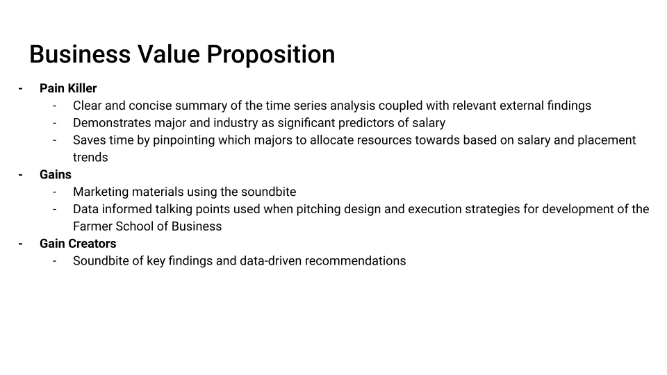

```{r setup, include=FALSE}
knitr::opts_chunk$set(echo = TRUE,message=FALSE,warning=FALSE)

#package intialization
rm(list = ls()) # clear global environment
graphics.off() # close all graphics
if(require(pacman)==FALSE) install.packages("pacman")
pacman::p_load(DataExplorer,tidyverse,readxl,stargazer,kableExtra,skimr,plotly)
```

# Introduction and Purpose

The goal of this project is to answer the question: "What are the macro placement and salary trends we are seeing over the past three years?". To do so, we have identified potential pains for our audience. Such pains consist of:

-   Lack of information to better guide students down the right career path
-   Finding students high-paying jobs that fit their major
-   Deeper understanding of salary trends by industry
-   Limited staffing to allocate sufficient time to each student's needs

To eliminate these pains, we intend to pilot an FSB Placement Analysis where we will visualize and understand salary and placement trends. We will also do external research of salary trends in related industries, and deliver a soundbite of key findings and data-driven recommendations.

## BVP




This is our Business Value Proposition. Using the pains and painkillers we can guide the direction and scope of our analysis to ensure we address the needs of our client.

# Data Sources

We have data from 3 years of graduates, 2019 - 2021, representing their results from surveys on their career placement results once they left college. There are 42 variables initially, but these may be pruned down as necessary for the needs of our analysis. The data was derived by Dr. Jones-Farmer from the Oracle Business Intelligence Enterprise Edition (OBIEE) maintained by Miami adminsitration, or from the self reported senior survey.

- nmajor: numeric,derived, the number of majors
- major1: text, OBIEE, first major
- major 2: text, OBIEE, second major
- BBRJ: binary, OBIEE, an attribute of a student, but we do not know what this stands for
- Business Direct Admit: binary, OBIEE, a direct admit to FSB as a first year
- Combined Cacc and Masters: binary, OBIEE, combined degree student
- Dean's List: binary, OBIEE, achieve dean's list status at least once
- First Generation College Stdnt: binary, OBIEE, first generation student status
- FSB Scholars: binary, OBIEE, FSB scholars program
- Honors Program: binary, OBIEE, member of University honors program
- President's list: binary, OBIEE, achieved president's list at least once
- Study Abroud Courtesy Account: binary, OBIEE, do not know meaning
- Transfer Work: binary, OBIEE, do not know exact meaning
- Cum Laude: binary, OBIEE, graduated Cum Laude
- Magna Cum Laude: binary, OBIEE, graduated Magna Cum Laude
- Summa Cum Laude: binary, OBIEE, graduated Summa Cum Laude
- University Honors: binary, OBIEE, graduated with University Honors
- University Honors w/Distinction: binary, OBIEE, graduated with University Honors with Distinction
- minor1: text, OBIEE, first listed minor
- minor2: text, OBIEE, second listed minor
- IPEDS.Race.Ethnicity: text, OBIEE, race/ethnicity
- Gender: text, OBIEE, sex
- GPA.Range: text, OBIEE, GPA within a .5 range
- Term.Code: numberic, OBIEE, First four digits are the physcal year (beginning in July, e.g. July 2020 is FY 2021). Last two digits is the term (10=fall, 15=winter, 20=spring, 30=summer).
- Year.x: text, derived, first four digits of Term.Code stored as a character variable
- latin_honors: text, survey, latin honors designation
- survey_city: text, survey, student reported city in which their job is located
- survey_company: text, survey, student reported company in which they accepted a job
- survey_deptfunc: text, survey, student reported job function
- survey_gradprogram: text, survey, student reported graduate program they will be attending
- survey_gradschool: text, survey, stuent reported graduate school they will be attending
- survey_internfour: text, survey, student reported fourth internship they held during college
- survey_internthree: text, survey, student reported third internship they held during college
- survey_interntwo: text, survey, student reported second internship they held during college
- survey_internone: text, survey, student reported first internship they held during college
- Survey_internships: text, survey, Student reported number of internships they held during college
- survey_offers: text, survey, student reported number of offers for full time employment received
-  survey_plans: text, survey, student reported plans after graduation
- survey_pref_field: text, survey, student reported whether working in preferred field
- survey_pref_loc: text, survey, student reported whether working in preferred location
- survey_salary: numeric, survey, student reported salary
- survey_state: text, survey, student reported state in which job is located

## Read in the data

```{r}
data=readRDS(file = "FSB_BI_Survey_2019_2021.rds")
```

# Data Preprocessing

## Data Exploration

We used the skimr package and the head function to summarize and explore the data.

```{r}
skim(data)
```

### Key Takeaways 1

- Major and Minor are structured and clean with no values missing. There are no redundant major or minor listings, so these columns do not need further cleaning.
- There are a small amount of double majors that need to be properly represented so 
- The survey columns focusing on job placement and salary have ~50% of their values missing, indicating that they did not place. To simplify this in the future we will create a binary column to represent either being placed or not being placed.
- Column names sometimes have spaces, we will rename these to have underscores instead to make the data set easier to work with

```{r}
head(data)
```

### Key Takeaways 2

- The head of the data reveals there are many columns unnecessary for our analysis.
- In our analysis we need the year, the majors, the post graduation plans to determine placement, and salary columns (nmajor, major1, major2, year.x, survey_plans, survey_salary, Combined Bacc and Masters)
-Other columns can be dropped (BBRJ, Business Direct Admit, Dean's List, First Generation College Stdnt, FSB Scholars, Honor's Program, President's List, Study Abroad Courtesy Account, Transfer Work (Pre-Banner), Cum Laude, Magna Cum Laude, Summa Cum Laude, University Honors, UniversityHonors w/Distinction, minor1, minor2, IPEDS.Race.Ethnicity, Gender, GPA.Range, Term.Code, latin_honors, survey_city, survey_company, survey_deptfunc, survey_gradprogram, survey_gradschool, survey_internfour, survey_internone, survey_internships, survey_internthree, survey_interntwo, survey_offers, survey_pref_field, survey_pref_loc, survey_state)
- From the survey_plans column we can create a binary field for if the graduate placed or not, then we can drop survey_plans
- We are keeping Combined Bacc and Masters to keep the granularity for analyzing trends for Farmer as a whole. We are also keeping it so that if it turns out undergraduate and graduate students are not comparable for our analysis we have a way to find and drop those observations.


## Data Cleaning To Dos
- Removing spaces from column names
- Create binary variable based on survey_plans to determine if the student placed or not
- Drop unnecessary columns
- Ensure data integrity of columns being retained

### Remove spaces from column names

```{r}
names(data)[names(data) == "Business Direct Admit"] <- "Business_Direct_Admit"
names(data)[names(data) == "FSB Scholars"] <- "FSB_Scholars"
names(data)[names(data) == "Transfer Work (Pre-Banner)"] <- "Transfer_Work"
names(data)[names(data) == "University Honors"] <- "University_Honors"
names(data)[names(data) == "Combined Bacc and Masters"] <- "Combined_Bacc_and_Masters"
names(data)[names(data) == "Honors Program"] <- "Honors_Program"
names(data)[names(data) == "Cum Laude"] <- "Cum_Laude"
names(data)[names(data) == "UniversityHonors w/Distinction"] <- "UniversityHonors_Distinction"
names(data)[names(data) == "Dean's List"] <- "Deans_List"
names(data)[names(data) == "President's List"] <- "President_List"
names(data)[names(data) == "Magna Cum Laude"] <- "Magna_Cum_Laude"
names(data)[names(data) == "First Generation College Stdnt"] <- "First_Gen_College_Stdnt"
names(data)[names(data) == "Study Abroad Courtesy Account"] <- "Study_Abroad_Courtesy_Account"
names(data)[names(data) == "Summa Cum Laude"] <- "Summa_Cum_Laude"
```

```{r}
head(data)
```

### Creating and Removing Columns

In this chunk we create a binary field to represent which graduates placed into a job. N/A values were considered to not have placed into a job. This is because for analyzing placement trends we do not need to consider any granularity besides whether or not they placed. Where they placed or what alternate plans they had were not important for addressing the pains this analysis is focused on.

```{r}
data$placement = ifelse(data$survey_plan == "accepted fulltime job", 1, 0)
data$placement[is.na(data$placement)] <- 0
```

In the following chunk we drop the columns that are not relevant to the pains we are addressing.

```{r}
data = subset(data, select = -Business_Direct_Admit)
data = subset(data, select = -BBRJ)
data = subset(data, select = -survey_gradprogram)
data = subset(data, select = -Deans_List)
data = subset(data, select = -First_Gen_College_Stdnt)
data = subset(data, select = -FSB_Scholars)
data = subset(data, select = -Honors_Program)
data = subset(data, select = -President_List)
data = subset(data, select = -Study_Abroad_Courtesy_Account)
data = subset(data, select = -Transfer_Work)
data = subset(data, select = -Cum_Laude)
data = subset(data, select = -Magna_Cum_Laude)
data = subset(data, select = -Summa_Cum_Laude)
data = subset(data, select = -University_Honors)
data = subset(data, select = -UniversityHonors_Distinction)
data = subset(data, select = -minor1)
data = subset(data, select = -minor2)
data = subset(data, select = -IPEDS.Race.Ethnicity)
data = subset(data, select = -Gender)
data = subset(data, select = -GPA.Range)
data = subset(data, select = -Term.Code)
data = subset(data, select = -latin_honors)
data = subset(data, select = -survey_city)
data = subset(data, select = -survey_company)
data = subset(data, select = -survey_deptfunc)
data = subset(data, select = -survey_gradschool)
data = subset(data, select = -survey_internfour)
data = subset(data, select = -survey_internone)
data = subset(data, select = -survey_internships)
data = subset(data, select = -survey_internthree)
data = subset(data, select = -survey_interntwo)
data = subset(data, select = -survey_offers)
data = subset(data, select = -survey_pref_field)
data = subset(data, select = -survey_pref_loc)
data = subset(data, select = -survey_state)
data = subset(data, select = -survey_plans)
```

## Re-evaluating the data

```{r}
skim(data)
```

```{r}
head(data)
```

```{r}
data$year.x = as.integer(data$year.x)
```

- After cleaning our data and pruning down the variables we are using, the data appears to be ready for analysis.
- The data was very clean already but the one thing left to fix was changing the year.x variable to be an integer instead of a string. This was performed in the chunk above.


```{r}
majors_to_remove <- c("Interdisciplinary Bus Managemt", "Management and Organizations", "General Business")

data <- data[!(data$major1 %in% majors_to_remove), ]
```


### Save Cleaned Data
```{r}
write.csv(data, "CleanedStudentSuccessData.csv", row.names=FALSE)
```


# Computing Environment

```{r}
sessionInfo()
```

