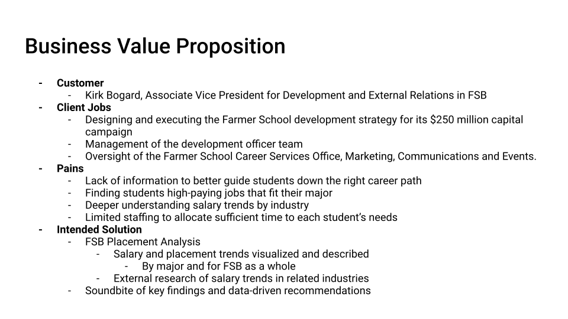
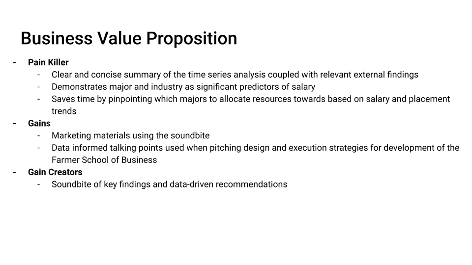

```{r setup, include=FALSE}
knitr::opts_chunk$set(echo = TRUE,message=FALSE,warning=FALSE)

#package intialization
rm(list = ls()) # clear global environment
graphics.off() # close all graphics
if(require(pacman)==FALSE) install.packages("pacman")
pacman::p_load(DataExplorer,tidyverse,readxl,stargazer,kableExtra,skimr,plotly)
```

# Introduction and Purpose

The goal of this project is for Nathan Craft and Elle Prusko to answer the question: "What are the macro placement and salary trends we are seeing over the past three years?". To do so, we have identified potential pains for our audience. Such pains consist of:

-   Lack of information to better guide students down the right career path
-   Finding students high-paying jobs that fit their major
-   Deeper understanding of salary trends by industry
-   Limited staffing to allocate sufficient time to each student's needs

To eliminate these pains, we intend to pilot an FSB Placement Analysis where we will visualize and understand salary and placement trends. We will also do external research of salary trends in related industries, and deliver a soundbite of key findings and data-driven recommendations.

## BVP





PUT AN ANNOTATION

# Data Sources

We have data from 3 years of graduates, 2019 - 2021, representing their results from surveys on their career placement results once they left college.

## Read in the data

```{r}
data=readRDS(file = "FSB_BI_Survey_2019_2021.rds")
```

# Data Preprocessing

## Data Exploration

put in summaries and head

```{r}
skim(data)
```
Key Takeaways:
- Major and Minor are structured and clean with no values missing. There are no redundant major or minor listings, so these columns do not need further cleaning.
- There are a small amount of double majors that need to be properly represented so 
- The survey columns focusing on job placement and salary have ~50% of their values missing, indicating that they did not place. To simplify this in the future we will create a binary column to represent either being placed or not being placed.

```{r}
head(data)
```


## To Dos
- Establish which columns we need for our analysis
- Drop unnecessary columns
- Create column for 1 = placed in a job, 0 = did not place
- Ensure data integrity of columns we are keeping

```{r}
skim(data)
```

```{r}
summary(data$survey_salary)
```


# The rest of your document

Add sections and subsections as necessary to guide your analysis
